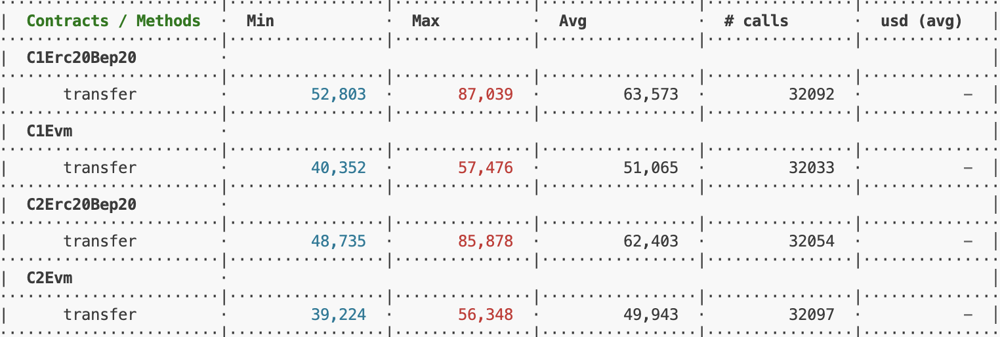

# PACT SWAP EVM Contracts (Hardhat)

This folder contains the Solidity contracts and Hardhat tooling used for the PACTSWAP EVM-side system.

## Scope (for audit)

Contracts of interest are located under `hardhat/contracts/`:

- **Transfer helpers**
  - `C1_EVM.sol`: ETH forwarding with per-(recipient, l2LinkedId) accounting + calldata payload in event
  - `C1_ERC20_BEP20.sol`: ERC20 forwarding with the same accounting + calldata payload in event
  - `C2_EVM.sol`: ETH forwarding with the same accounting (no calldata payload)
  - `C2_ERC20_BEP20.sol`: ERC20 forwarding with the same accounting (no calldata payload)
- **Token + fee pool**
  - `token/PactSwapToken.sol`: ERC20Permit + ERC20Burnable, mints initial supply to deployer
  - `token/FeePoolManager.sol`: burns the platform token and emits cross-chain events for redemption
  - `token/interfaces/IFeePoolManager.sol`: interface + events + errors for the fee pool

## High-level architecture

### Transfer helpers (C1/C2)

All transfer helper contracts implement the same accounting pattern:

- **Key**: `(recipient r, l2LinkedId l)` → `bytes32 key = keccak256(abi.encode(r, l))`
- **State per key**:
  - `paid (p)`: cumulative amount paid for this key
  - `nonce (n)`: monotonically increasing per key (emitted as the pre-increment value)
- **Bound**:
  - `m` is a **maximum allowed cumulative** paid amount for the key.
  - Each call adds `msg.value` (ETH) or `a` (ERC20) and reverts if the new cumulative total exceeds `m`.

Operationally, these contracts:

- Update accounting **before** the external interaction (ETH `call` or ERC20 `safeTransferFrom`).
- Emit event `T(...)` for downstream/off-chain correlation.

### FeePoolManager

`token/FeePoolManager.sol` is the EVM-side part of a cross-chain redemption flow:

- Users call `burnWithRedeem(amount, receiver)`:
  - burns `amount` of `pactswapToken` from the caller (requires allowance)
  - emits:
    - `BurnWithRedeem(...)` (EVM indexing)
    - `SendEventToCoinweb(SendToCoinwebEventType.Burn, ...)` (cross-chain consumer)
- Admin can call `updateFeeAddress(bytes32)`:
  - updates `COINWEB_FEE_ADDRESS`
  - emits:
    - `CoinwebFeeAddressUpdated(...)`
    - `SendEventToCoinweb(SendToCoinwebEventType.UpdateFeeAddress, ...)`

## Roles & permissions

- **FeePoolManager admin**
  - Set once at deployment (`admin = msg.sender`)
  - Can update Coinweb fee address and rotate admin via `updateAdmin`

Transfer helper contracts in `hardhat/contracts/*.sol` are permissionless.

## Gas usage notes

| Contract           | Max Previous Gas Usage | Max Optimized Gas Usage | Decrease |
| ------------------ | ---------------------- | ----------------------- | -------- |
| C1_EVM.sol         | 80,174                 | 57,476                  | 28.5%    |
| C1_ERC20_BEP20.sol | 111,689                | 87,039                  | 22.1%    |
| C2_EVM.sol         | 79,022                 | 56,348                  | 28.9%    |
| C2_ERC20_BEP20.sol | 110,548                | 85,878                  | 22.4%    |

### Stress tests result

